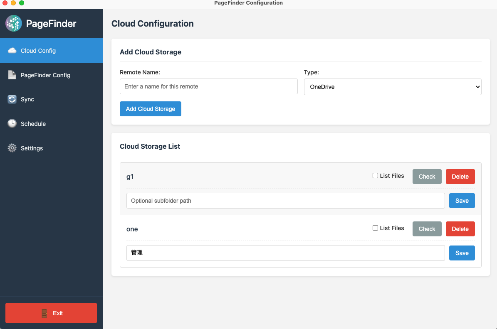

# Screenshot Guide for PageFinder Configuration Utility Documentation

This guide explains how to create and add screenshots to the PageFinder Configuration Utility documentation.

## Required Screenshots

The documentation references the following screenshots that need to be created:

1. **main_interface.png** - The main application interface showing the sidebar and content area
2. **cloud_config_section.png** - The Cloud Config section showing the add cloud form and cloud list
3. **pagefinder_config_section.png** - The PageFinder Config section showing the import form and test connection button
4. **sync_section.png** - The Sync section showing the test and execute buttons
5. **schedule_section.png** - The Schedule section showing the schedule form and sync log
6. **settings_section.png** - The Settings section showing the configuration options
7. **add_cloud_form.png** - The form for adding a new cloud storage connection
8. **cloud_list.png** - The list of configured cloud storage connections
9. **cloud_check_result.png** - The result of checking a cloud storage connection
10. **subfolder_config.png** - Configuring a subfolder for a cloud storage connection
11. **import_config.png** - Importing a PageFinder configuration file
12. **test_connection_result.png** - The result of testing a PageFinder connection
13. **purge_test_result.png** - The result of testing a purge operation
14. **purge_exec_result.png** - The result of executing a purge operation
15. **sync_test_result.png** - The result of testing synchronization
16. **sync_exec_result.png** - The result of executing synchronization
17. **sync_progress.png** - Synchronization in progress
18. **schedule_form.png** - The form for setting up scheduled synchronization
19. **schedule_result.png** - The result of setting up a schedule
20. **sync_log.png** - The sync log from a scheduled synchronization
21. **settings_form.png** - The settings form with configuration options
22. **settings_saved.png** - Confirmation of saved settings
23. **confirmation_dialog.png** - A confirmation dialog for destructive operations
24. **error_dialog.png** - An error dialog showing an error message
25. **notification.png** - A notification showing operation status

## How to Create Screenshots

1. **Run the Application**: Launch the PageFinder Configuration Utility application
2. **Navigate to Each Section**: Use the sidebar to navigate to each section of the application
3. **Capture Screenshots**: Use your operating system's screenshot tool to capture each screen:
   - macOS: Press `Command + Shift + 4`, then select the area
   - Windows: Press `Windows + Shift + S`, then select the area
   - Linux: Use a tool like Screenshot, Flameshot, or press `PrintScreen`
4. **Capture Specific Elements**: For dialogs, notifications, and specific UI elements, trigger them first:
   - For confirmation dialogs: Try to delete a cloud storage connection
   - For error dialogs: Try to test a connection with invalid settings
   - For notifications: Perform an action that shows a notification

## Screenshot Specifications

- **Resolution**: Screenshots should be at least 1200x800 pixels
- **Format**: Save all screenshots as PNG files
- **File Size**: Keep file sizes reasonable (under 500KB per image if possible)
- **Content**: Ensure no sensitive information is visible in screenshots
- **Clarity**: Ensure text and UI elements are clearly visible

## Where to Save Screenshots

Save all screenshots in the `docs/images/` directory with the exact filenames listed above.

## How Screenshots Are Displayed in the Documentation

The HTML documentation (user-manual.html and quick-start-guide.html) already includes references to these screenshots using HTML `` tags:

```html

<div class="image-caption">The main interface of the PageFinder Configuration Utility</div>
```

The Markdown documentation (user-manual.md and quick-start-guide.md) includes references using Markdown image syntax:

```markdown

*The main interface of the PageFinder Configuration Utility*
```

## Testing the Documentation with Screenshots

After adding all screenshots:

1. Open the HTML documentation files in a web browser:
   ```
   open docs/user-manual.html
   ```
   or
   ```
   start docs/user-manual.html
   ```

2. Verify that all screenshots are displayed correctly
3. Check that the images are properly sized and aligned
4. Ensure that the captions match the images

## Example Directory Structure After Adding Screenshots

```
docs/
├── images/
│   ├── main_interface.png
│   ├── cloud_config_section.png
│   ├── pagefinder_config_section.png
│   └── ... (other screenshots)
├── user-manual.html
├── quick-start-guide.html
└── ... (other documentation files)
```

## Troubleshooting

If screenshots are not displaying correctly:

1. **Check File Names**: Ensure the filenames exactly match those referenced in the documentation
2. **Check File Paths**: Make sure the screenshots are in the `docs/images/` directory
3. **Check File Format**: Ensure all files are saved as PNG format
4. **Check Browser Cache**: Try clearing your browser cache or opening in a private/incognito window