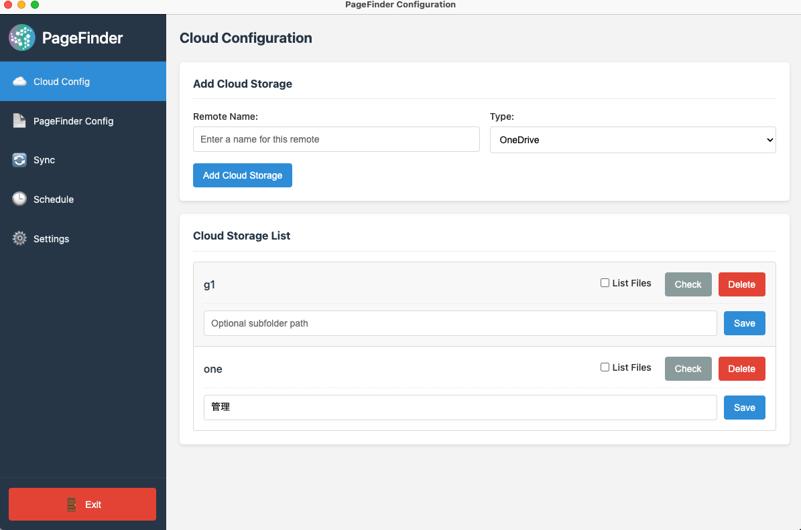

# PageFinder Configuration Utility - User Manual

## Table of Contents

1. [Introduction](#1-introduction)
2. [Installation](#2-installation)
3. [Getting Started](#3-getting-started)
4. [Cloud Configuration](#4-cloud-configuration)
5. [PageFinder Configuration](#5-pagefinder-configuration)
6. [Synchronization](#6-synchronization)
7. [Scheduling](#7-scheduling)
8. [Settings](#8-settings)
9. [Troubleshooting](#9-troubleshooting)
10. [FAQ](#10-faq)
11. [Glossary](#11-glossary)

## 1. Introduction

The PageFinder Configuration Utility is a desktop application designed to simplify the management of cloud storage connections with PageFinder. It provides a user-friendly interface for configuring, testing, and synchronizing data between various cloud storage providers and PageFinder's storage system.

*The main interface of the PageFinder Configuration Utility*

### 1.1 Key Features

- Configure and manage connections to multiple cloud storage providers
- Import and test PageFinder configuration
- Synchronize files between cloud storage and PageFinder
- Schedule automatic synchronization
- Purge orphaned folders from PageFinder

### 1.2 System Requirements

- **Operating Systems**:
  - macOS 10.13 or later (Intel or Apple Silicon)
  - Windows 10 or later
  - Linux (major distributions)
- **Disk Space**: At least 200MB of free disk space
- **Dependencies**: rclone (automatically managed by the application)

## 2. Installation

### 2.1 macOS Installation

1. Download the appropriate installer for your Mac:
   - For Apple Silicon (M1/M2) Macs: `PageFinder Configuration-[version]-mac-arm64-installer.dmg`
   - For Intel Macs: `PageFinder Configuration-[version]-mac-x64-installer.dmg`
2. Open the downloaded DMG file
3. Drag the PageFinder Configuration app to your Applications folder
4. Open the app from your Applications folder
   - Note: On first launch, you may need to right-click the app and select "Open" to bypass macOS security

### 2.2 Windows Installation

1. Download the Windows installer: `PageFinder Configuration-[version]-win-x64-setup.exe`
2. Run the installer and follow the on-screen instructions
3. Launch the application from the Start menu or desktop shortcut

### 2.3 Linux Installation

1. Download the appropriate package for your distribution:
   - AppImage: `PageFinder Configuration-[version]-linux-x86_64.AppImage`
   - Debian/Ubuntu: `pagefinder-configuration_[version]_amd64.deb`
2. Install the package using your distribution's package manager or run the AppImage
3. Launch the application from your applications menu

## 3. Getting Started

### 3.1 First Launch

When you first launch the PageFinder Configuration Utility, you'll see the main interface with a sidebar navigation menu on the left and the main content area on the right.

*The main interface showing the sidebar navigation and content area*

The sidebar contains the following sections:
- Cloud Config
- PageFinder Config
- Sync
- Schedule
- Settings

### 3.2 Initial Setup

Before using the application, you should:

1. Verify the rclone path in the Settings section
2. Verify the workspace directory in the Settings section
3. Add at least one cloud storage connection
4. Import your PageFinder configuration

*The Settings section for configuring rclone path and workspace directory*

## 4. Cloud Configuration

The Cloud Config section allows you to manage your cloud storage connections.

*The Cloud Config section showing the add cloud form and cloud list*

### 4.1 Adding Cloud Storage

To add a new cloud storage connection:

1. Navigate to the Cloud Config section
2. Enter a name for your remote in the "Remote Name" field
   - Use a descriptive name without spaces (e.g., "gdrive", "onedrive-work")
3. Select the type of cloud storage from the dropdown menu:
   - Google Drive
   - OneDrive
   - Box
   - Local Directory
4. Click the "Add Cloud Storage" button
5. Follow the authentication process for your selected provider:
   - For Google Drive, OneDrive, and Box: You'll be guided through an OAuth authentication flow
   - For Local Directory: You'll need to select a directory on your local machine

*The form for adding a new cloud storage connection*

**Note**: There is a limit of 3 remote connections. If you need to add a new one, you may need to delete an existing connection first.

### 4.2 Managing Cloud Storage

For each cloud storage connection, you can:

1. **Configure a Subfolder**: Limit synchronization to a specific subfolder within your cloud storage
   - Enter the subfolder path in the text field
   - Click "Save" to save the subfolder configuration

   
   *Configuring a subfolder for a cloud storage connection*

2. **Check Connection**: Test the connection to your cloud storage
   - Toggle "List Files" to see a list of files in your cloud storage
   - Click "Check" to test the connection
   - The results will be displayed below

   
   *The result of checking a cloud storage connection*

3. **Delete Connection**: Remove the cloud storage connection
   - Click "Delete" to remove the connection
   - Confirm the deletion in the confirmation dialog

   
   *Confirmation dialog for deleting a cloud storage connection*

## 5. PageFinder Configuration

The PageFinder Config section allows you to import and test your PageFinder configuration.

*The PageFinder Config section showing the import form and test connection button*

### 5.1 Importing PageFinder Configuration

To import your PageFinder configuration:

1. Navigate to the PageFinder Config section
2. Click "Browse" to select your PageFinder configuration file
3. Select the configuration file from your computer
4. Click "Import Configuration" to import the file
5. The application will validate and import the configuration

*Importing a PageFinder configuration file*

### 5.2 Testing PageFinder Connection

To test your PageFinder connection:

1. After importing your configuration, click "Test Connection"
2. The application will attempt to connect to PageFinder using your configuration
3. The results will be displayed in the result container
4. If successful, you'll see a list of folders in your PageFinder storage

*The result of testing a PageFinder connection*

### 5.3 Purging Orphan Folders

To purge orphaned folders from PageFinder:

1. Click "Test Purge" to see which folders would be purged
2. Review the purge log to ensure you want to proceed

   
   *The result of testing a purge operation*

3. If you're satisfied with the results, click "Execute Purge"
4. Confirm the purge operation in the confirmation dialog
5. The purge log will be updated with the results of the operation

   
   *The result of executing a purge operation*

## 6. Synchronization

The Sync section allows you to synchronize files between your cloud storage and PageFinder.

*The Sync section showing the test and execute buttons*

### 6.1 Testing Synchronization

To test synchronization without actually transferring files:

1. Navigate to the Sync section
2. Click "Test Sync" to perform a dry run
3. The application will simulate the synchronization process
4. Review the sync log to see what would be transferred

*The result of testing synchronization*

### 6.2 Executing Synchronization

To execute the synchronization and actually transfer files:

1. After testing synchronization, click "Execute Sync"
2. The application will start transferring files between your cloud storage and PageFinder
3. The sync log will be updated with the progress and results of the operation
4. Wait for the synchronization to complete

*The result of executing synchronization*

**Note**: Synchronization may take a long time depending on the amount of data being transferred.

*Synchronization in progress*

## 7. Scheduling

The Schedule section allows you to set up automatic synchronization at specified times.

*The Schedule section showing the schedule form and sync log*

### 7.1 Setting Up Scheduled Synchronization

To set up scheduled synchronization:

1. Navigate to the Schedule section
2. Enter the time for synchronization in the "Sync Time" field (HH:MM in 24-hour format)
3. Click "Set Up Schedule" to create the schedule
4. The application will set up a scheduled task or cron job on your system
5. The result will be displayed in the result container

*The form for setting up scheduled synchronization*

*The result of setting up a schedule*

### 7.2 Viewing Sync Logs

To view the logs from the most recent scheduled synchronization:

1. The last sync log will be displayed in the "Last Sync Log" section
2. Click the refresh button to reload the log if needed

*The sync log from a scheduled synchronization*

## 8. Settings

The Settings section allows you to configure the application's environment.

*The Settings section showing the configuration options*

### 8.1 Configuring rclone Path

To configure the path to the rclone executable:

1. Navigate to the Settings section
2. Enter the path to the rclone executable in the "rclone Path" field
   - Default on macOS and Linux: `/usr/local/bin/rclone`
   - Default on Windows: `rclone.exe` (assumed to be in PATH)
3. Alternatively, click "Browse" to select the rclone executable
4. Click "Save Settings" to save the configuration

*The settings form with configuration options*

### 8.2 Configuring Workspace Directory

To configure the workspace directory:

1. Enter the path to the workspace directory in the "Workspace Directory" field
   - Default on macOS: `~/.config/pf-config`
   - Default on Windows: `%APPDATA%\pf-config`
   - Default on Linux: `~/.config/pf-config`
2. Alternatively, click "Browse" to select a directory
3. Click "Save Settings" to save the configuration

*Confirmation of saved settings*

## 9. Troubleshooting

### 9.1 Common Issues

#### Application Won't Start

- Ensure you have sufficient permissions to run the application
- Check if there's enough disk space
- Try reinstalling the application

#### Cloud Storage Connection Fails

- Verify your internet connection
- Check if your authentication credentials are valid
- Ensure the cloud service is operational
- Try removing and re-adding the connection

*Error dialog showing a connection failure*

#### Synchronization Fails

- Check both cloud storage and PageFinder connections
- Verify that you have the necessary permissions
- Check if there's enough space in your PageFinder storage
- Review the sync log for specific error messages

#### Scheduled Sync Doesn't Run

- Verify that your computer was on at the scheduled time
- Check if the application has the necessary permissions to create scheduled tasks
- Review the system's task scheduler or cron jobs
- Check the sync log for any error messages

### 9.2 Log Files

The application stores log files in the workspace directory:

- `sync.log`: Contains logs from synchronization operations
- `purge.log`: Contains logs from purge operations
- `app-config.json`: Contains application configuration

*Notification showing operation status*

## 10. FAQ

### 10.1 General Questions

**Q: How many cloud storage connections can I add?**  
A: You can add up to 3 cloud storage connections.

**Q: Does the application transfer my files through its servers?**  
A: No, the application facilitates direct transfer between your cloud storage and PageFinder. Your files do not pass through any intermediate servers.

**Q: Can I use the application without an internet connection?**  
A: You need an internet connection to authenticate with cloud storage providers and to synchronize with PageFinder. However, you can configure local directory connections without internet access.

### 10.2 Technical Questions

**Q: What happens if synchronization is interrupted?**  
A: The application uses rclone, which is designed to handle interruptions gracefully. If synchronization is interrupted, you can simply run it again, and it will continue from where it left off.

**Q: Can I synchronize multiple cloud storage connections simultaneously?**  
A: The application synchronizes one cloud storage connection at a time to ensure stability and prevent resource contention.

**Q: How secure is my data?**  
A: The application uses secure authentication methods for cloud storage providers. Your credentials are stored securely in the workspace directory with appropriate permissions.

## 11. Glossary

- **Remote**: A configured connection to a cloud storage provider or local directory
- **Workspace Directory**: The directory where the application stores its configuration, metadata, and log files
- **rclone**: The command-line program used by the application to handle file operations with cloud storage
- **Subfolder**: A specific folder within a cloud storage connection that limits the scope of synchronization
- **Purge**: The process of removing orphaned folders from PageFinder that no longer have corresponding cloud storage
- **Sync**: The process of transferring files between cloud storage and PageFinder